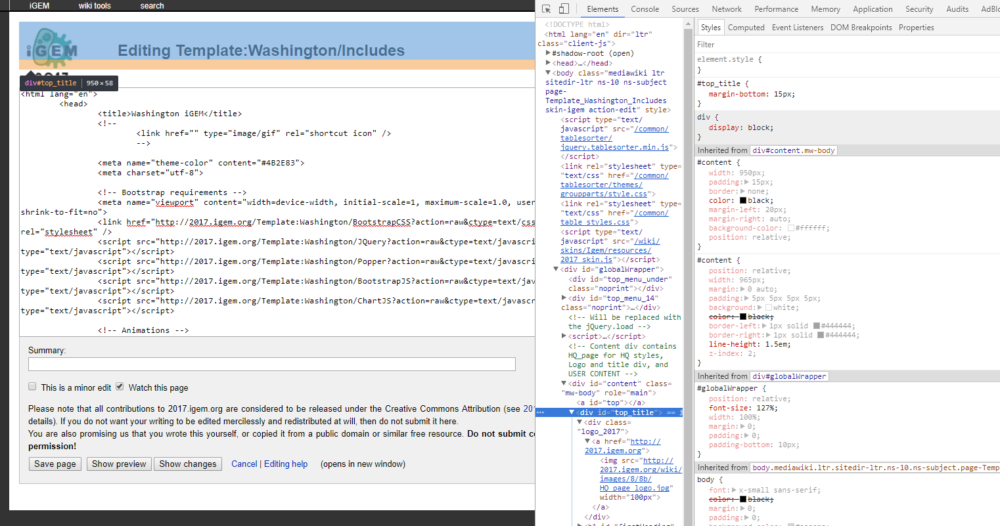

# Templates, CSS, and JavaScript {#tcj}

## Making a template for code {#template}
A **template** is a page you can use for many things. These templates can contain HTML or even just plaintext code. The advantage of having these templates is that you can basically source in everything from a template into a regular page.

To create a template page, it is the exact same as making a blank page from \@ref(blankPage). You wouldn't know the difference.

* To get to a template page, you use the format `http://[YEAR].igem.org/Template:[TEAM]/[TEMPLATE]`.
* To use the template in your actual page, you use `{{[TEAM]/[TEMPLATE]}}`

So for example, here are the steps to making a template page and including it into a regular page:

* Going to a blank template page: [http://2017.igem.org/Template:Washington/TestPage](http://2017.igem.org/Template:Washington/TestPage)
* Now let us just add a simple `<html><strong>Testinput</strong></html>` to the page, which should output a bolded "**Testinput**" onto an almost blank page
* To include this onto the NewPageTest that we made in \@ref(blankPage), we `edit` the page and simply type `{{Washington/TestPage}}`. We find that NewPageTest now looks exactly like the TestPage template.
* Don't worry about the page still having "Team:Washington" or the iGEM logos on it. Read on to learn how to get rid of these.

## Including JavaScript and CSS {#includingJSCSS}
Now that you have a grasp of how templates work, you can simply copy paste your CSS or JavaScript **directly** into a blank template, and click save.

**HOWEVER**, there is a very niche way to get the code from the template *correctly* and incorporate it into your page. You may find major errors if you just wrap the code in `<style>` or `<script>` tags. (One example is that MediaWiki does not parse the `&` symbol correctly, so if you have `&&` anywhere in the code, it will break. This is crucial for using jQuery or Bootstrap API)

**The correct way to incorporate code**:

* Take your template link: `http://[YEAR].igem.org/Template:[TEAM]/[TEMPLATE]`
* Add `?action=raw&ctype=text/[CSS OR JAVASCRIPT]` where `[CSS OR JAVASCRIPT]` is `css` or `javascript` depending on what type of code is in the template.
* Incorporate it into an actual page with `script` or `style` tags like so: <br/>`<link href="http://[YEAR].igem.org/Template:[TEAM]/[TEMPLATE]?action=raw&ctype=text/css" type="text/css" rel="stylesheet" />` or <br /> `<script src="http://[YEAR].igem.org/Template:[TEAM]/[TEMPLATE]?action=raw&ctype=text/javascript" type="text/javascript"></script>`

Those two lines of code provided at the end of those steps will act exactly like incorporating a local JavaScript/CSS file or using a CDN.

## Using templates to put them all together {#putTogether}
You don't have to follow this guide entirely, but what we've been doing with our wiki is putting all the stuff you'd normally put in the header of an HTML page into a template, so that way all we would have to do is put in the template caller (`{{[TEAM]/[TEMPLATE]}}`) and then our body content inside `<html></html>`. Here is an example of what we have in our [Template:Includes](http://2017.igem.org/Template:Washington/Includes)-- you can modify this for any CSS or JavaScript you want to include.

```
<html lang="en">
	<head>
		<title>Washington iGEM</title>
		<!--
			<link href="" type="image/gif" rel="shortcut icon" />
			-->

                <meta name="theme-color" content="#4B2E83">
		<meta charset="utf-8">

		<!-- Bootstrap requirements -->
   		<meta name="viewport" content="width=device-width, initial-scale=1, maximum-scale=1.0, user-scalable=no, shrink-to-fit=no">
   		<link href="http://2017.igem.org/Template:Washington/BootstrapCSS?action=raw&ctype=text/css" type="text/css" rel="stylesheet" />
		<script src="http://2017.igem.org/Template:Washington/JQuery?action=raw&ctype=text/javascript" type="text/javascript"></script>
   		<script src="http://2017.igem.org/Template:Washington/Popper?action=raw&ctype=text/javascript" type="text/javascript"></script>
   		<script src="http://2017.igem.org/Template:Washington/BootstrapJS?action=raw&ctype=text/javascript" type="text/javascript"></script>
                <script src="http://2017.igem.org/Template:Washington/ChartJS?action=raw&ctype=text/javascript" type="text/javascript"></script>

   		<!-- Animations -->
   		<link href="http://2017.igem.org/Template:Washington/Animate?action=raw&ctype=text/css" type="text/css" rel="stylesheet" />


   		<!-- Team Washington includings -->
		<link href="http://2017.igem.org/Template:Washington/GlobalCSS?action=raw&ctype=text/css" type="text/css" rel="stylesheet" />
		<script src="http://2017.igem.org/Template:Washington/GlobalJS?action=raw&ctype=text/javascript" type="text/javascript"></script>

	</head>
</html>
```

Then, on a page like the one we made in section \@ref(blankPage) we have the following code:

```
{{Washington/Includes}}
<html>
  <body>
    ...
  </body>
</html>
```

Even though you have your own CSS and JavaScript on the page doesn't mean you're ready yet. Read on to learn about overriding iGEM's default CSS.

## Overriding iGEM CSS {#overrideCSS}
Perhaps one of the most **frustrating but important** part of working with iGEM's MediaWiki system is overriding their default CSS. No matter how much you try to override, sometimes there will still be minute bugs due to not overriding part of the code. At the bottom of this section, there is a code that you simply need to copy paste into a new template (\@ref(template)) to override a good amount of iGEM CSS.

For things that aren't yet overridden and are causing errors, you will need to:

* Right click on the element that is bugging up
* Inspect - This will pop up an inspection window. Under elements you will see a window for HTML, CSS of the selected element, and box model of the selected element.<br/>
* In the above, for example, let's say we want to delete this from showing.
* In a custom CSS Template (\@ref(template)) we override the class by putting the same class name.

```
#top_title {
  display: none;
  width: 0px;
}
```

The final step will require the most problem solving skills to figure out what is being overridden. It takes time to get a feel for what exactly is wrong. Thankfully, you'll encounter this problem the least with the following override code:

```
#sideMenu,
#top_title {
  display: none;
  width: 0px;
}
#bodyContent a[href ^="https://"], .link-https {
  padding-right: 0px;
}
#content {
  width: 100%;
  padding: 0px;
  border: none;
  color: black;
  margin-left: auto;
  margin-right: auto;
  background-color: #fff;
  position: relative;
}
#globalWrapper {
  padding-bottom: 0;
  font-size: 100%;
}
#top_menu_under {
  height: 0px;
}
#top_menu_14 {
  height: 22px;
}
#HQ_page h1,
h2,
h3,
h4,
h5 {
  font-family: INSERTFONT, Roboto, "Helvetica Neue", Arial, sans-serif;
  font-weight: normal;
  padding: 0px;
  line-height: normal;
  }
#HQ_page p {
  font-family: INSERTFONT, Roboto, "Helvetica Neue", Arial, sans-serif;
  text-align: left;
  font-size: 1.25rem;
}
#top_menu_inside #user_item {
  float: left;
  padding-top: 0px;
  margin-right: none;
}
#bodyContent a[href ^="mailto:"], .link-mailto {
    padding-right: 0px;
    background: none;
}
```

Though, your job isn't done there. You'll want to mess around with that code to change what fonts you're using.

## Clearing cache {#cache}

> "Why did the page stay the same???? I updated my CSS and JavaScript but the functionality and looks aren't changing!"

My friend, you'll want to learn about a magical thing called clearing your cache. The cache is a temporary storage for web browsers that allows the web page to be loaded faster. Things like images, CSS, JavaScript, etc. all get stored in cache so the next time the page is loaded, it will load faster.

**Easy way to clear cache**: You can go to your browser settings and clear the cache, or you can also go to `F12 (or right click > inspect)` > `top right corner 3 dots` > `settings` > `scroll down to network` > `Disable cache (while DevTools is open)`

Now, whenever you press `F12` on your keyboard to bring up the inspect panel, then refresh the page, the cache for the page will instantly be cleared and you will have the latest update of the page.
