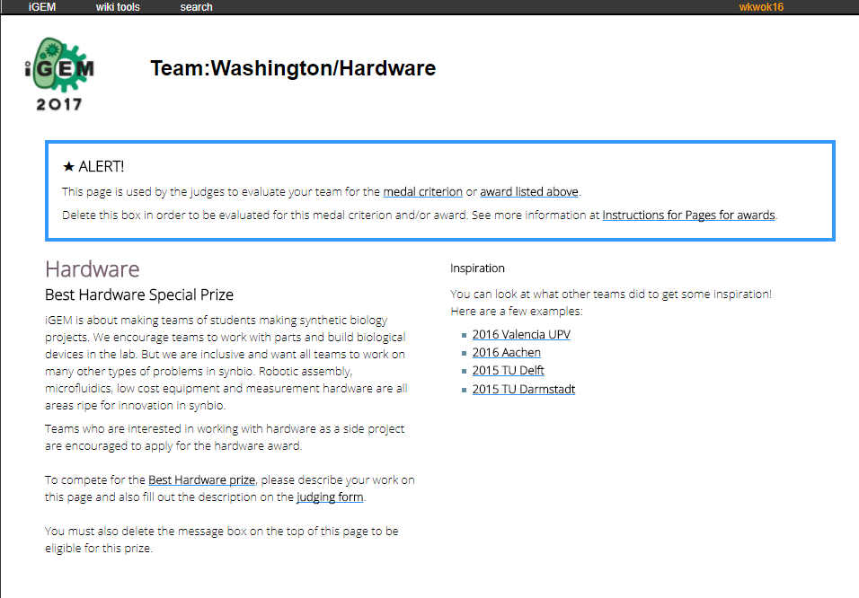
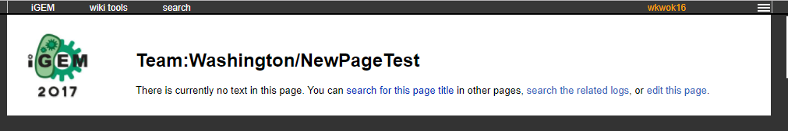
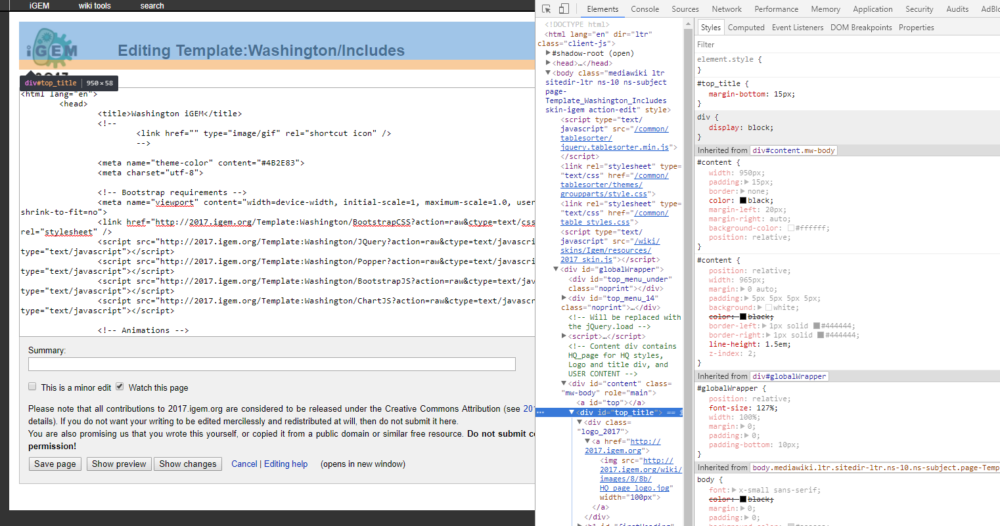

# Creating/editing wiki pages {#addPage}

Before we can make a wiki, we have to know how to do basic edits to a page. You'd be surprised at how many things require special attention to modify on the wiki.

If you've ever made your own website before, you may have had to just upload all the relevant files and immediately have a website that you could use. iGEM's uses **MediaWiki**, which **requires** you to type in the HTML for every individual page. Controversially, a lot of web programmers dislike this model, because it increases complexity if they want to do complex stuff. However, note that using MediaWiki is a godsend for some teams that don't have any knowledge of web programming. That is why there will likely be *no change* to this structure for years to come.

For any demonstrations, all demonstration pages will use a page from [Team:Washington's iGEM Wiki](http://2017.igem.org/Team:Washington). We will also be using Google Chrome as a web browser.

## Wiki pages structure {#structure}

The iGEM wiki is structured in a very straightforward manner.

`http://[YEAR].igem.org/Team:[TEAM]` will lead you to the main page. Take note that there is **no backslash** after this. If you have a backslash, then you will go to a blank uncreated page.

There are many special pages that the judges take into consideration for determining what medal you will receive at the Jamboree. These pages can be found [here](http://2017.igem.org/Judging/Pages_for_Awards). For example, the `Attributions` page for your team will follow the structure `http://[YEAR].igem.org/Team:[TEAM]/Attributions`.

Additionally, the human practices pages are a bit funky, but they follow the same structure, they just have a `/HP/` before them. You *shouldn't* think about this as if it was a file pathway, but rather a page with the page title `/HP/Gold_Integrated` or so.

## Judged pages {#existingPage}

All the special pages noted in section \@ref(structure) will be an existing page for you to work on. It looks something like the following:



For these pages, you simply have to follow these steps to modify the page:
1. Be logged in and make sure you are in your team registry (otherwise you won't be allowed to edit the pages)
1. Go to the top bar and find `wiki tools`
1. Hover over that and go to `edit page`
1. Modify the page as you like (Read below for more tips)
1. Click `save`, and the page will be updated

Note how there is a blue bordered **ALERT** box on this page. If you want to be evaluated for this award, you will **have** to remove (before a certain date) the `div` that houses this alert message. The code that you have to remove will look something like this:

```
<div class="column full_size judges-will-not-evaluate">
<h3>★  ALERT! </h3>
<p>This page is used by the judges to evaluate your team for the <a href="http://2017.igem.org/Judging/Medals">medal criterion</a> or <a href="http://2017.igem.org/Judging/Awards"> award listed above</a>. </p>
<p> Delete this box in order to be evaluated for this medal criterion and/or award. See more information at <a href="http://2017.igem.org/Judging/Pages_for_Awards"> Instructions for Pages for awards</a>.</p>
</div>
```

Remove **all** of the above code if you want to be considered for the award.

## Creating a new blank page {#blankPage}

Creating a new page is very simple. First, type this into the navigation bar: `http://[YEAR].igem.org/Team:[TEAM]/[PAGE_YOU_WANT_TO_MAKE]`. In the next example, We will be creating a new page `NewPageTest`.

1. First, we head to [http://2017.igem.org/Team:Washington/NewPageTest](http://2017.igem.org/Team:Washington/NewPageTest) <br />
We should see something like this: <br /><br />
1. Go click on `edit this page` or go to `wiki tools` > `edit`
1. Edit your heart out. HTML inside the edit box will appear as rendered HTML after saving.

## Making a template for code {#template}
A **template** is a page you can use for many things. These templates can contain HTML or even just plaintext code. The advantage of having these templates is that you can basically source in everything from a template into a regular page.

To create a template page, it is the exact same as making a blank page from \@ref(blankPage). You wouldn't know the difference.
* To get to a template page, you use the format `http://[YEAR].igem.org/Template:[TEAM]/[TEMPLATE]`.
* To use the template in your actual page, you use `{{[TEAM]/[TEMPLATE]}}`

So for example, here are the steps to making a template page and including it into a regular page:

* Going to a blank template page: [http://2017.igem.org/Template:Washington/TestPage](http://2017.igem.org/Template:Washington/TestPage)
* Now let us just add a simple `<html><strong>Testinput</strong></html>` to the page, which should output a bolded "**Testinput**" onto an almost blank page
* To include this onto the NewPageTest that we made in \@ref(blankPage), we `edit` the page and simply type `{{Washington/TestPage}}`. We find that NewPageTest now looks exactly like the TestPage template.
* Don't worry about the page still having "Team:Washington" or the iGEM logos on it. Go onto the next section to learn how to get rid of these.

## Overriding iGEM CSS {#overrideCSS}
Perhaps one of the most **frustrating but important** part of working with iGEM's MediaWiki system is overriding their default CSS. No matter how much you try to override, sometimes there will still be minute bugs due to not overriding part of the code. At the bottom of this section, there is a code that you simply need to copy paste into a new template (\@ref(template)) to override a good amount of iGEM CSS.

For things that aren't yet overridden and are causing errors, you will need to
* Right click on the element that is bugging up
* Inspect - This will pop up an inspection window. Under elements you will see a window for HTML, CSS of the selected element, and box model of the selected element.<br/>
* In the above, for example, let's say we want to delete this from showing.
* In a custom CSS Template (\@ref(template)) we override the class by putting the same class name

```
#top_title {
  display: none;
  width: 0px;
}
```

The final step will require the most problem solving skills to figure out what is being overridden. It takes time to get a feel for what exactly is wrong. Thankfully, you'll encounter this problem the least with the following override code:

```
#sideMenu,
#top_title {
  display: none;
  width: 0px;
}
#bodyContent a[href ^="https://"], .link-https {
  padding-right: 0px;
}
#content {
  width: 100%;
  padding: 0px;
  border: none;
  color: black;
  margin-left: auto;
  margin-right: auto;
  background-color: #fff;
  position: relative;
}
#globalWrapper {
  padding-bottom: 0;
  font-size: 100%;
}
#top_menu_under {
  height: 0px;
}
#top_menu_14 {
  height: 22px;
}
#HQ_page h1,
h2,
h3,
h4,
h5 {
  font-family: INSERTFONT, Roboto, "Helvetica Neue", Arial, sans-serif;
  font-weight: normal;
  padding: 0px;
  line-height: normal;
  }
#HQ_page p {
  font-family: INSERTFONT, Roboto, "Helvetica Neue", Arial, sans-serif;
  text-align: left;
  font-size: 1.25rem;
}
#top_menu_inside #user_item {
  float: left;
  padding-top: 0px;
  margin-right: none;
}
#bodyContent a[href ^="mailto:"], .link-mailto {
    padding-right: 0px;
    background: none;
}
```

Though, your job isn't done there. You'll want to mess around with that code to change what fonts you're using.

## Clearing cache {#cache}

> "Why did the page stay the same????"

My friend, you'll want to learn about a magical thing called clearing your cache. The cache is a temporary storage for web browsers that allows the web page to be loaded faster. Things like images, CSS, JavaScript, etc. all get stored in cache so the next time the page is loaded, it will load faster.

**Easy way to clear cache**: You can go to your browser settings and clear the cache, or you can also go to `F12 (or right click > inspect)` > `top right corner 3 dots` > `settings` > `scroll down to network` > `Disable cache (while DevTools is open)`

Now, whenever you press `F12` on your keyboard to bring up the inspect panel, then refresh the page, the cache for the page will instantly be cleared and you will have the latest update of the page.

## Including JavaScript and CSS {#includingJSCSS}

## Using templates to put them all together {#putTogether}
